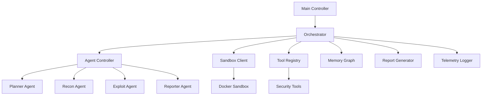

# BBH-AI: Multi-Agent AI-Orchestrated Security Testing Engine

[](https://www.python.org/downloads/)
[](LICENSE)
[](#)

BBH-AI is an advanced, AI-powered security testing platform that combines multiple AI models with specialized agents to perform comprehensive security assessments. It orchestrates reconnaissance, vulnerability analysis, exploitation simulation, and reporting through a sophisticated multi-agent system.

## 🚀 Key Features

### 🔍 Multi-Agent AI Orchestration
- **Planner Agent**: Strategically plans the security assessment approach
- **Reconnaissance Agent**: Performs intelligent asset discovery and enumeration
- **Exploitation Agent**: Simulates attack scenarios and identifies vulnerabilities
- **Reporting Agent**: Generates comprehensive, actionable security reports

### 🧠 Advanced AI Integration
- Support for multiple LLM providers (OpenAI, Anthropic, Google, DeepSeek)
- Configurable AI swarm for consensus-based decision making
- Temperature-controlled responses for different agent roles
- Context-aware prompting with memory graph retention

### 🛡️ Secure Sandboxed Execution
- Isolated Docker-based sandboxing for tool execution
- Resource-limited containers to prevent resource exhaustion
- Network-isolated environments to prevent lateral movement
- Ephemeral sandboxes that auto-clean after execution

### 📊 Comprehensive Security Testing
- **Subdomain Enumeration**: Discover all associated domains and subdomains
- **Host Discovery**: Identify live hosts and open ports
- **Technology Detection**: Identify technologies, frameworks, and services
- **Vulnerability Scanning**: Automated detection of common vulnerabilities
- **Misconfiguration Analysis**: Identify insecure configurations
- **OSINT Gathering**: Collect intelligence from public sources

### ⚙️ Flexible Configuration
- YAML-based configuration system with environment variable support
- Multiple scanning modes (quick, standard, deep, stealth)
- Customizable tool chains and agent behaviors
- Diff mode for comparing scans and identifying new findings

### 📈 Advanced Analytics
- Threat Confidence Index (TCI) scoring system
- Memory graph for contextual awareness across scan phases
- Real-time telemetry and logging
- CI/CD integration support with notifications

## 🏗️ Architecture Overview



## 🛠️ Installation

### Prerequisites
- Python 3.11+
- Docker (for sandbox functionality)
- Git

### Quick Setup

1. Clone the repository:
```bash
git clone https://github.com/gl1tch0x1/bbh_ai.git
cd bbh_ai
```

2. Run the installer script:
```bash
chmod +x installer.sh
./installer.sh
```

3. Configure your environment:
```bash
cp config.example.yaml config.yaml
cp .env.example .env
```

4. Edit `config.yaml` and `.env` with your API keys and preferences.

### Manual Installation

1. Create a virtual environment:
```bash
python -m venv .venv
source .venv/bin/activate  # On Windows: .venv\Scripts\activate
```

2. Install dependencies:
```bash
pip install -r requirements.txt
```

3. Build the sandbox image:
```bash
docker build -t bbh/sandbox:latest -f sandbox/Dockerfile.sandbox .
```

## ▶️ Usage

### Basic Scan
```bash
python main.py --target example.com
```

### Advanced Options
```bash
# Quick scan mode
python main.py --target example.com --config config.yaml --mode quick

# CI/CD integration
python main.py --target example.com --ci

# Dry run (no actual scanning)
python main.py --target example.com -n
```

### Configuration
The main configuration file is `config.yaml`. Key sections include:

- `llm`: Configure your AI model providers and API keys
- `agents`: Set model preferences and temperatures for each agent
- `scan`: Define scanning modes, timeouts, and diff settings
- `sandbox`: Control sandbox behavior and resource limits
- `tools`: Enable/disable specific security tools

Environment variables can be set in the `.env` file for sensitive information.

## 🧪 Security Tools Included

### Subdomain Enumeration
- Subfinder
- Amass
- Dnsx
- Puredns

### Host Discovery
- Nmap
- Httpx
- Tlsx

### Web Application Scanning
- Nuclei (community templates)
- Sqlmap
- Dalfox (XSS scanning)
- Wafw00f (WAF detection)

### OSINT & Intelligence Gathering
- Whois lookup
- Email finder
- Waymore (archive crawling)
- GAU (GitHub and URL discovery)

### Technology Detection
- Wappalyzer-inspired tech detection
- CMSeek (CMS detection)
- Js-parser (JavaScript analysis)

## 📋 Scanning Phases

### Phase A: Asset Discovery
Intelligent enumeration of all associated assets including subdomains, IP addresses, and cloud resources.

### Phase B: Host Analysis
Detailed port scanning, service detection, and technology fingerprinting.

### Phase C: Vulnerability Assessment
Systematic identification of known vulnerabilities and misconfigurations.

### Phase D: Exploitation Simulation
Safe exploitation attempts to validate vulnerability impact.

### Phase E: Intelligence Gathering
Collection of OSINT data and passive reconnaissance information.

### Phase F: Report Generation
Compilation of findings into comprehensive, actionable reports.

## 🔧 CI/CD Integration

BBH-AI supports integration with CI/CD pipelines through:
- JSON output format for easy parsing
- Exit codes for success/failure indication
- Notification hooks for Slack, Discord, and custom webhooks
- Diff mode for identifying new findings between scans

Example GitHub Actions workflow:
```yaml
- name: Security Scan
  run: |
    python main.py --target ${{ secrets.SCAN_TARGET }} --ci
```

## 📊 Sample Report Output

Reports are generated in multiple formats:
- HTML (interactive dashboard-style reports)
- JSON (machine-readable detailed findings)
- PDF (professional presentation-ready documents)

Sample finding structure:
```json
{
  "id": "CVE-2023-12345",
  "severity": "high",
  "title": "SQL Injection Vulnerability",
  "description": "The application is vulnerable to SQL injection...",
  "evidence": "POST /login with payload...",
  "remediation": "Implement parameterized queries...",
  "tc_score": 8.7
}
```

## 🛡️ Safety & Ethics

BBH-AI includes multiple safety mechanisms:
- Rate limiting to prevent target disruption
- Scope validation to prevent unintended scanning
- Auto-healing mechanisms for handling failures gracefully
- Legal compliance checking for OSINT activities

Always ensure you have explicit authorization before scanning any targets.

## 🤝 Contributing

We welcome contributions! Please see our [CONTRIBUTING.md](CONTRIBUTING.md) for details on how to contribute to BBH-AI.

1. Fork the repository
2. Create a feature branch
3. Commit your changes
4. Push to the branch
5. Create a Pull Request

## 📄 License

This project is licensed under the MIT License - see the [LICENSE](LICENSE) file for details.

## 📞 Support

For support, please open an issue on GitHub or contact the development team.

## 🙏 Acknowledgments

- Thanks to all the open-source security tools that power BBH-AI
- Inspired by the need for more intelligent, AI-driven security testing
- Built for security professionals and bug bounty hunters worldwide