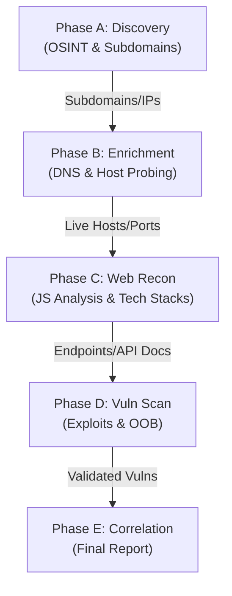

# BBH-AI — Autonomous AI Hacker Platform

> **Autonomous AI agents that act just like real hackers.** BBH-AI runs code dynamically, finds vulnerabilities, and validates them through actual proof-of-concepts. Built for developers and security teams who need fast, accurate security testing without the overhead of manual pentesting or the false positives of static analysis tools.

[](https://www.python.org/)
[](LICENSE)
[](https://crewai.com)

---

### ✨ Key Capabilities

*   **Full hacker toolkit out of the box** — Equipped with over 45 industry-standard security tools.
*   **Teams of agents that collaborate and scale** — Multi-agent orchestration for comprehensive coverage.
*   **Real validation with PoCs, not false positives** — Every finding is verified through active exploitation.
*   **Developer-first CLI with actionable reports** — Clean, structured data for human and machine consumption.
*   **Auto-fix & reporting** — Accelerate remediation with detailed vulnerability analysis.

---

### 🎯 Use Cases

*   **Application Security Testing** — Detect and validate critical vulnerabilities in your applications.
*   **Rapid Penetration Testing** — Get penetration tests done in hours, not weeks, with compliance reports.
*   **Bug Bounty Automation** — Automate bug bounty research and generate PoCs for faster reporting.
*   **CI/CD Integration** — Run tests in CI/CD to block vulnerabilities before reaching production.

---

## 🚀 Features

### 🤖 Agentic Security Tools
BBH-AI comes equipped with a comprehensive security testing toolkit orchestrated by AI:

*   **Full HTTP Proxy** — Full request/response manipulation and analysis.
*   **Browser Automation** — Multi-tab browser for testing of XSS, CSRF, auth flows.
*   **Terminal Environments** — Interactive shells for command execution and testing.
*   **Python Runtime** — Custom exploit development and validation.
*   **Reconnaissance** — Automated OSINT and attack surface mapping.
*   **Code Analysis** — Static and dynamic analysis capabilities.
*   **Knowledge Management** — Structured findings and attack documentation.

### 🛡️ Comprehensive Vulnerability Detection
Identify and validate a wide range of high-impact security vulnerabilities:

*   **Access Control** — IDOR, privilege escalation, auth bypass.
*   **Injection Attacks** — SQL, NoSQL, command injection.
*   **Server-Side** — SSRF, XXE, deserialization flaws.
*   **Client-Side** — XSS, prototype pollution, DOM vulnerabilities.
*   **Business Logic** — Race conditions, workflow manipulation.
*   **Authentication** — JWT vulnerabilities, session management.
*   **Infrastructure** — Misconfigurations, exposed services.

---

## 🧠 Graph of Agents
Advanced multi-agent orchestration for comprehensive security testing. BBH-AI uses a **Persistent MemoryGraph** to synchronize intelligence across distributed workers.

*   **Distributed Workflows** — Specialized agents for different attacks and assets.
*   **Scalable Testing** — Parallel execution for fast comprehensive coverage.
*   **Dynamic Coordination** — Agents collaborate and share discoveries in real-time.



---

## 🖥️ Getting Started

### 1. Install local infrastructure
```bash
# Linux/macOS
chmod +x installer.sh && sudo ./installer.sh

# Docker-based scaling (Redis + Celery)
docker-compose up -d --build
```

### 2. Configure API Keys
```bash
cp .env.example .env
# Edit .env with your keys (OpenAI, Anthropic, Google, etc.)
```

### 3. Run a Scan
```bash
# Full Distributed Scan
python main.py --target example.com --distributed

# Local Async Scan
python main.py --target example.com --mode deep
```

---

## 🧰 Tool Matrix (Sample)

| Category | Tools |
|:---|:---|
| **OSINT** | `whois`, `LeakSearch`, `msftrecon` |
| **Asset Mapping** | `subfinder`, `dnsx`, `puredns`, `urlfinder` |
| **API/Web** | `swaggerspy`, `porch-pirate`, `httpx`, `wafw00f` |
| **Exploitation** | `nuclei`, `sqlmap`, `dalfox`, `interactsh` |

---

## ⚠️ Legal Disclaimer
> BBH-AI is intended **only for authorized security testing**. Never scan targets you do not own or have explicit written permission to test. Misuse may violate computer fraud laws.

---
*Happy Hacking! 🎯 — Built by [gl1tch0x1](https://github.com/gl1tch0x1)*