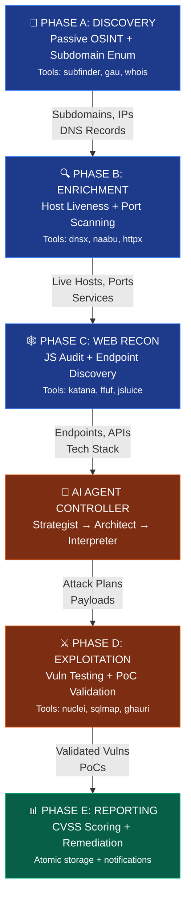
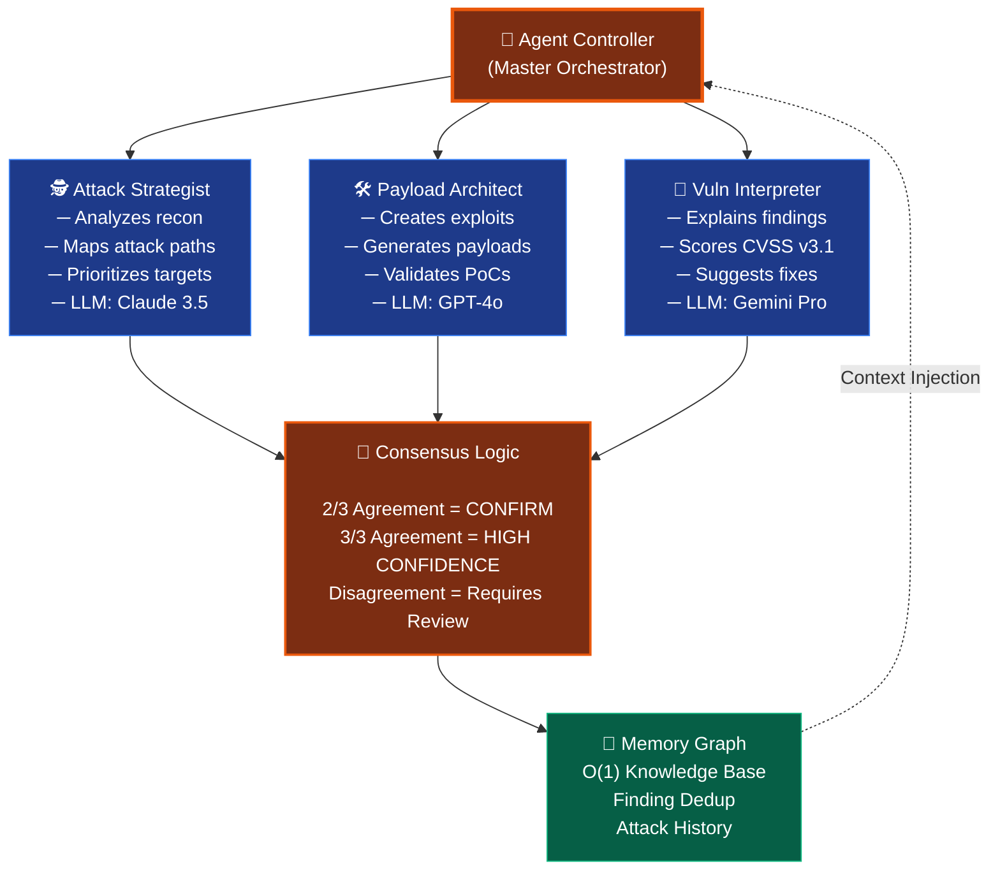

# 🤖 BBH-AI: Autonomous AI Security Testing Platform

> **Industrial-Grade Autonomous Red Teaming & Bug Bounty Engine**  
> **Version:** 4.0 | **Status:** Production Ready | **License:** MIT

BBH-AI is an **enterprise-grade autonomous security testing platform** that combines AI reasoning with offensive security tools to autonomously discover, validate, and exploit vulnerabilities. Using Swarm Consensus Intelligence and Chain-of-Thought reasoning, BBH-AI operates like an expert penetration tester—but faster, deeper, and 24/7.

---

## 🎯 Key Capabilities

### 🧠 AI-Powered Threat Intelligence
- **Swarm Consensus**: Multiple LLM models (GPT-4, Claude 3.5, Gemini) reason together to reach high-confidence decisions
- **Chain-of-Thought Reasoning**: Explicit step-by-step attack planning, validation, and root cause analysis
- **Adaptive Exploitation**: AI generates context-aware payloads based on discovered vulnerabilities
- **CVSS v3.1 Scoring**: Automated severity calculation with zero hallucinations

### 🛡️ Industrial-Grade Reliability
- **Atomic Data Integrity**: Write-to-temp-then-rename ensures no data corruption even during crashes
- **Distributed Resilience**: Celery workers with idempotency locks and exponential backoff
- **Hardened Sandboxing**: Docker containers with `--cap-drop=ALL` restrict tool privileges
- **Local-First Architecture**: All scan data stored locally in structured JSON (no external DBs)

### 🚀 Comprehensive Coverage
- **50+ Integrated Tools**: ScanTools spanning OSINT, reconnaissance, and vulnerability assessment
- **5-Phase Workflow**: Structured discovery → enrichment → web recon → exploitation → reporting
- **Multi-Agent Architecture**: Specialized agents for strategy, payload generation, and interpretation
- **Autonomous Healing**: Auto-healer compensates for tool failures and adapts scanning strategy

---

## 📋 Use Cases

| Use Case | Ideal For | Key Feature |
|----------|-----------|-------------|
| **Bug Bounty Automation** | Rapid target assessment at scale | CVSS scoring + PoC validation |
| **Continuous Security Testing** | Night/weekend scanning automation | 24/7 operation, no manual oversight |
| **Enterprise Pentesting** | Internal/external security posture | Distributed scanning across subnet ranges |
| **Compliance & Audits** | Security audit documentation | Atomic reporting, CVSS scores, root cause |
| **Vulnerability Research** | 0-day discovery & validation | AI-guided exploitation attempts |

---

## ⭐ Key Features

### Discovery & Reconnaissance
- ✅ **Passive OSINT**: Subdomain enumeration, WHOIS, DNS leaks, GitHub metadata
- ✅ **Active Probing**: Port scanning, service fingerprinting, tech stack detection
- ✅ **Web Analysis**: JavaScript auditing, API endpoint discovery, dependency analysis
- ✅ **Data Correlation**: Relationship mapping between hosts, IPs, and ASNs

### Vulnerability Assessment  
- ✅ **50+ Vulnerability Types**: SQLi, XSS, SSRF, RCE, authentication bypasses, misconfigurations
- ✅ **Automated PoC Generation**: Creates working exploits for validated vulnerabilities
- ✅ **Playwright-Based Validation**: Runs JavaScript-dependent exploits in headless browsers
- ✅ **Out-of-Band Testing**: Interactsh integration for blind vulnerability confirmation

### Reporting & Analytics
- ✅ **Multi-Format Output**: Markdown, JSON, HTML with interactive dashboards
- ✅ **Risk Metrics**: CVSS v3.1 scores, severity breakdown, trend analysis
- ✅ **Executive Summaries**: High-level findings for stakeholders
- ✅ **Evidence Artifacts**: Screenshots, HTTP requests, stack traces

---

## 🏗️ Scan Workflow

BBH-AI executes a rigorous 5-phase workflow enhanced by AI interpretation at every step:



### Phase Execution Details

| Phase | Purpose | Key Tools | Output |
|-------|---------|-----------|--------|
| **A: Discovery** | Passive intelligence gathering | `subfinder`, `gau`, `whois`, `shodan` | Subdomains, IPs, DNS records |
| **B: Enrichment** | Host and port enumeration | `dnsx`, `puredns`, `naabu`, `httpx` | Live hosts, ports, services |
| **C: Web Recon** | Application analysis | `jsluice`, `katana`, `urless`, `ffuf` | Endpoints, APIs, tech stacks |
| **D: Exploitation** | Active vulnerability testing | `nuclei`, `sqlmap`, `ghauri`, `commix` | Validated vulnerabilities |
| **E: Reporting** | Analysis & documentation | `storage`, `validator`, `analyzer` | Reports + CVSS scores |

---

## 🤖 Agent Architecture

BBH-AI uses a trio of specialized AI agents that work collaboratively:



### Agent Specializations

| Agent | Role | LLM Models | Decision Logic |
|-------|------|-----------|---|
| **Strategist** | Attack planning | Claude 3.5 (primary) | Multi-agent voting |
| **Architect** | Payload generation | GPT-4o (primary) | Consensus on PoC validity |
| **Interpreter** | Analysis & scoring | Gemini Pro (primary) | Expert-level CVSS calculation |

---

## 🛠️ Tool Architecture

BBH-AI integrates **50+ security tools** organized in 9 categories:

```
tools/
├── api_leaks/           (5 tools)  - API secret discovery
├── cloud/               (3 tools)  - Cloud misconfiguration scanning
├── dns/                 (4 tools)  - DNS enumeration & analysis
├── github/              (6 tools)  - GitHub reconnaissance
├── google_dorking/      (2 tools)  - Google search enumeration
├── hosts/               (8 tools)  - Port scanning & service detection
├── mail/                (2 tools)  - Email reconnaissance
├── misconfig/           (3 tools)  - Misconfiguration detection
├── osint/               (7 tools)  - Open-source intelligence
├── subdomains/          (14 tools) - Subdomain enumeration
├── vuln/                (12 tools) - Vulnerability scanning & exploitation
└── web/                 (18 tools) - Web application testing
```

Each tool is wrapped with:
- ✅ Standardized input/output interfaces
- ✅ Timeout handling & crash recovery
- ✅ Telemetry & execution logging
- ✅ Category tagging for intelligent orchestration
- ✅ Configuration persistence (config.yaml)

---

## 🚀 Getting Started

### Prerequisites
- **Python 3.12+**
- **Docker** (with Docker daemon running)
- **4GB RAM** (8GB+ recommended)
- **Linux/macOS/Windows with WSL2**

### Installation

#### Option 1: Automated (Recommended)
```bash
git clone https://github.com/gl1tch0x1/bbh_ai.git && cd bbh_ai

# Automated setup (handles Python, Go tools, Docker)
chmod +x installer.sh
sudo ./installer.sh
```

#### Option 2: Manual
```bash
# Clone repo
git clone https://github.com/gl1tch0x1/bbh_ai.git && cd bbh_ai

# Create Python environment
python3.12 -m venv venv
source venv/bin/activate  # On Windows: venv\Scripts\activate

# Install Python packages
pip install -r requirements.txt

# Build Docker image
python rebuild_docker.py

# Verify setup
python sandbox_diagnostics.py
```

### Configuration

1. **Create `.env` file** with API keys:
   ```bash
   OPENAI_API_KEY=sk-...
   ANTHROPIC_API_KEY=sk-ant-...
   GOOGLE_API_KEY=AIza...
   ```

2. **Review `config.yaml`** (defaults shown).
   ```yaml
   llm:
     default_model: "gpt-4o"
     consensus_mode: true
   
   scan:
     mode: "deep"                    # quick, deep, stealth
     timeout: 300                    # seconds per tool
     js_file_limit: 50               # JavaScript files to analyze
     max_concurrent_tools: 5
     use_vuln_analyzer: true          # enable AI vuln interpretation
   
   sandbox:
     enabled: true                   # run tools inside Docker
     image: "bbh-ai-unified"       # sandbox image name
     host_workspace: "/path/on/host"  # optional path to mount into container
   
   ci:
     enabled: true
   ```

   The `sandbox.host_workspace` value, if provided, will be bind-mounted into
   the container at `/tmp/bbh_workspace`. Tools executed in the sandbox will
   store their temporary files there and the orchestrator can inspect them when
   needed for debugging.


3. **Verify system health**:
   ```bash
   python main.py --health
   ```

---

## 📊 Tool Matrix  

### Complete Tool Inventory (50+)

| Category | Count | Key Tools | Purpose |
|----------|-------|-----------|---------|
| **OSINT** | 7 | `gau`, `waymore`, `whois`, `shodan` | General intelligence |
| **Subdomains** | 14 | `subfinder`, `crt.sh`, `dnsx`, `puredns` | Enumeration |
| **Hosts** | 8 | `naabu`, `httpx`, `ipinfo`, `cdncheck` | Port scanning |
| **Web** | 18 | `katana`, `ffuf`, `jsluice`, `urless` | Web reconnaissance |
| **Vuln** | 12 | `nuclei`, `sqlmap`, `ghauri`, `commix` | Exploitation |
| **GitHub** | 6 | `trufflehog`, `gitleaks`, `gato` | Secret detection |
| **Cloud** | 3 | `cloud_enum`, `s3scanner` | Cloud misconfig |
| **API** | 5 | `swagger-spy`, `swaggerator` | API discovery |
| **DNS** | 4 | `digx`, `dnstake` | DNS analysis |
| **Mail** | 2 | `mail_hygiene`, `spoofcheck` | Email security |

### Tool Execution Model

```mermaid
graph LR
    TR["🔧 Tool Registry<br/>(Auto-discovery)"]
    
    CAT["🏷️ Category Filter<br/>OSINT, Vuln<br/>Discovery, etc"]
    
    PHASE["📍 Phase Filter<br/>A, B, C, D, E"]
    
    CONFIG["⚙️ Config Loader<br/>Timeouts<br/>Parameters"]
    
    EXEC["⚡ Tool Executor<br/>(Docker/Local)"]
    
    SANDBOX["🐳 Sandbox<br/>─ Timeout Handler<br/>─ Crash Recovery<br/>─ Resource Limits"]
    
    RES["📤 Results<br/>+ Telemetry<br/>+ Logs"]
    
    TR --> CAT
    CAT --> PHASE
    PHASE --> CONFIG
    CONFIG --> EXEC
    EXEC --> SANDBOX
    SANDBOX --> RES
    
    style TR fill:#7c2d12,stroke:#ea580c,color:#fff
    style CAT fill:#1e3a8a,stroke:#3b82f6,color:#fff
    style PHASE fill:#1e3a8a,stroke:#3b82f6,color:#fff
    style CONFIG fill:#1e3a8a,stroke:#3b82f6,color:#fff
    style EXEC fill:#7c2d12,stroke:#ea580c,color:#fff
    style SANDBOX fill:#065f46,stroke:#10b981,color:#fff,stroke-width:2px
    style RES fill:#1e3a8a,stroke:#3b82f6,color:#fff
```



---

## 💻 Usage Examples

### Basic Scan
```bash
python main.py --target example.com
```

### Advanced: YOLO Mode (Maximum Firepower)
```bash
python main.py --target example.com --yolo
# Automatically enables: --distributed, --deep, --oob, --ai
```

### Custom Configuration
```bash
python main.py --target example.com \
  --mode deep \
  --distributed \
  --ai "gpt-4o,claude-3-5-sonnet" \
  --phase A \            # Start from Phase A
  --oob                  # Enable out-of-band testing
  --verbose              # Debug logging
```

### System Verification
```bash
python main.py --health           # 12-pillar health check
python main.py --update           # Update codebase & tools
python sandbox_diagnostics.py      # Verify Docker/Python/Config
```

---

## 📈 Performance Characteristics

| Metric | Value | Notes |
|--------|-------|-------|
| **Scan Startup** | 2-5s | Docker container boot |
| **Phase A (Discovery)** | 5-15 min | Subdomain enumeration |
| **Phase B (Enrichment)** | 10-30 min | Port & service scanning |
| **Phase C (Web Recon)** | 5-20 min | Endpoint discovery |
| **Phase D (Exploitation)** | 15-60 min | Vuln testing |
| **Phase E (Reporting)** | 2-5 min | Report generation |
| **Total (Full Deep Scan)** | 1-2 hours | For medium targets |
| **Concurrent Tools** | 5 (default) | Configurable |
| **Memory Usage** | 0.5-2 GB | Depends on target size |
| **Docker Image** | ~2 GB | bbh-ai-unified |

---

## 📁 Project Structure

```
bbh-ai/
├── agent_controller.py          # AI agent orchestration (Strategist, Architect, Interpreter)
├── orchestrator.py               # Phase workflow manager
├── main.py                       # CLI entry point
├── health.py                     # 12-pillar diagnostic
│
├── engine/
│   ├── analyzer.py              # Vulnerability analysis & interpretation
│   ├── auto_healer.py           # Automatic error recovery
│   ├── storage.py               # Atomic file operations
│
├── sandbox/
│   ├── server.py                # FastAPI sandbox server
│   ├── client.py                # Docker container manager
│   ├── Dockerfile.sandbox       # Container definition
│
├── tools/                        # 50+ security tool wrappers
│   ├── registry.py              # Tool discovery & loading
│   ├── base.py                  # Base tool interface
│   ├── wrappers/                # Tool-specific implementations
│
├── tasks/                       # Celery distributed tasks
│   ├── phase_tasks.py
│   ├── recon_tasks.py
│   ├── vuln_tasks.py
│   ├── report_tasks.py
│
├── memory/
│   └── graph.py                 # Knowledge graph with O(1) lookup
│
├── telemetry/
│   └── logger.py                # Structured JSON logging
│
├── reporting/
│   └── generator.py             # Multi-format report generation
│
├── validation/
│   └── validator.py             # Finding validation & CVSS scoring
│
├── ci/
│   └── notifier.py              # CI/CD integrations
│
├── config.yaml                  # Configuration file
├── requirements.txt             # Python dependencies
├── docker-compose.yml           # Redis + Docker setup
├── installer.sh                 # Automated installer
├── rebuild_docker.py            # Docker image rebuild tool
└── README.md                    # This file
```

---

## 🔐 Security & Privacy

- ✅ **Local-First**: All scan data stored in `scans/<run-id>/` directory
- ✅ **No External DBs**: No third-party persistence, no data exfiltration
- ✅ **Container Isolation**: Docker containers run with minimal privileges
- ✅ **Encrypted Configs**: API keys stored in `.env`, never in code
- ✅ **Audit Logs**: Complete execution telemetry in `telemetry.json`

---

## 🤝 Contributing

BBH-AI welcomes contributions. Please see [CONTRIBUTING.md](CONTRIBUTING.md) for:
- Development setup
- Code style guidelines
- Pull request process
- Tool wrapper template

---

## 📄 License

BBH-AI is licensed under the MIT License. See [LICENSE](LICENSE) for details.

**⚠️ Disclaimer**: Unauthorized security testing is illegal. Use BBH-AI only on targets you own or have explicit permission to test. The developers assume no liability for misuse.

---

## 🙋 Support

- **Issues**: GitHub Issues for bug reports and feature requests
- **Documentation**: See [CONTRIBUTING.md](CONTRIBUTING.md) and [SECURITY.md](SECURITY.md)
- **Security**: Report vulnerabilities to [SECURITY.md](SECURITY.md)

---

**Built with ♥ by [gl1tch0x1](https://github.com/gl1tch0x1)** 🏹

