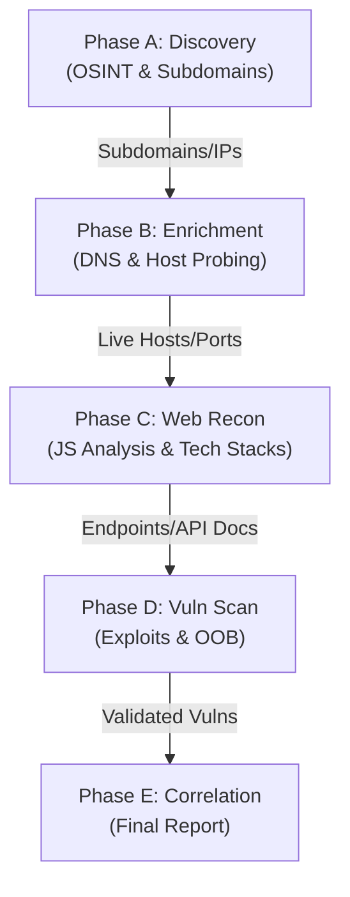
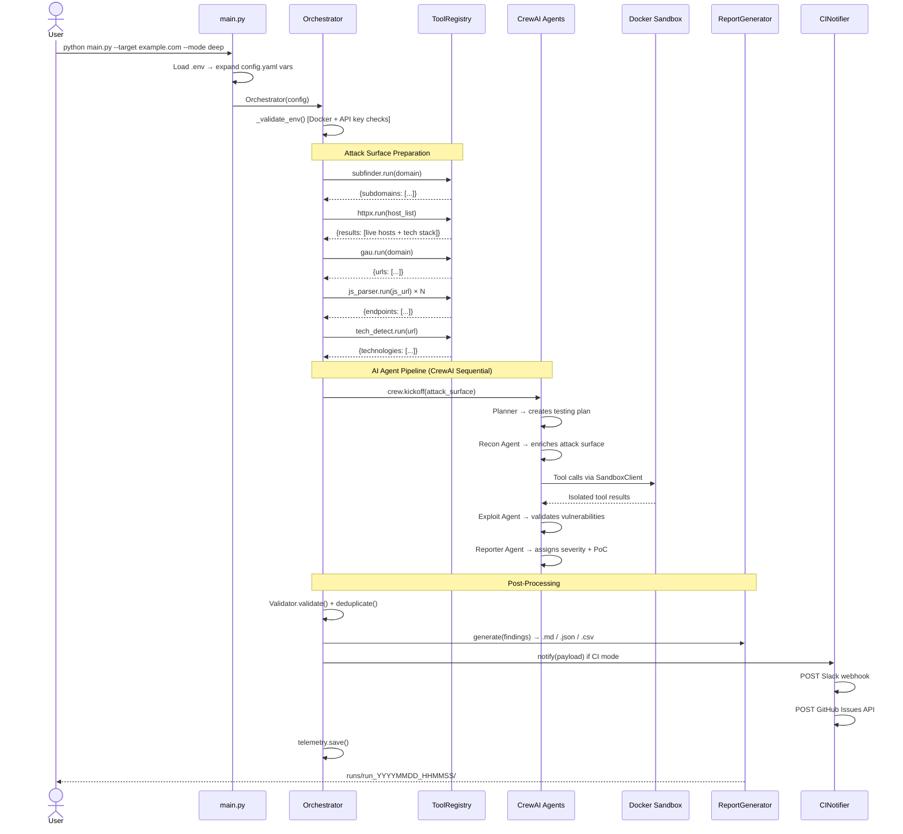
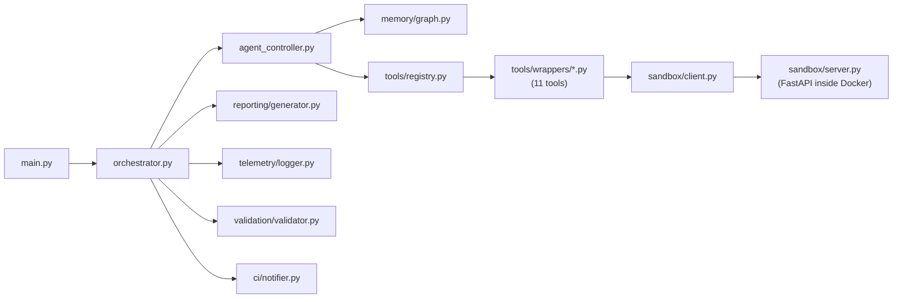

# BBH-AI — Multi-Agent AI-Orchestrated Security Testing Engine

> **BBH-AI** is an advanced bug bounty automation framework powered by multi-agent AI. It chains security tools together intelligently, runs exploits in isolated Docker sandboxes, and generates structured reports ready for CI/CD pipelines.

[](https://www.python.org/)
[](LICENSE)
[](https://crewai.com)

---

## ✨ Features

| Feature | Detail |
|---------|--------|
| 🤖 **A-E Phased Orchestration** | Discovery → Enrichment → Web Recon → Vuln Scan → Reporting |
| 🛡️ **OOB / Blind Detection** | Integrated `interactsh` for DNS/HTTP interaction analysis |
| 🔒 **Advanced Sandboxing** | Unified Docker environment with resource-limited tool execution |
| 🛠️ **40+ Integrated Tools** | OSINT, API Leaks, GitHub, Cloud, Subdomains, Hosts, Web & Vuln |
| 📄 **Intelligent Correlation** | Multi-agent synthesis removes false positives and assigns risk |
| � **Modular CLI** | Run full scans or target specific phases (`--phase B`) |
| � **Deep Visibility** | Telemetry logs for every tool call and agent decision |

---

## 🏗️ Architecture: A-E Phased Workflow

BBH-AI now follows a mature, sequential orchestration pipeline to ensure maximum data enrichment and minimal noise.



---

## 🔄 Scan Workflow



---

## 🚀 Quick Start

### 1. Clone & Install

```bash
git clone https://github.com/gl1tch0x1/bbh_ai.git
cd bbh-ai

# Create virtual environment
python -m venv venv
source venv/bin/activate        # Windows: venv\Scripts\activate

# Install Python dependencies
pip install -r requirements.txt
```

### 2. Install Security Tools

```bash
# Run the installer (Linux/macOS)
chmod +x installer.sh && sudo ./installer.sh

# Or install manually
go install -v github.com/projectdiscovery/subfinder/v2/cmd/subfinder@latest
go install -v github.com/projectdiscovery/httpx/cmd/httpx@latest
go install -v github.com/lc/gau/v2/cmd/gau@latest
go install -v github.com/projectdiscovery/katana/cmd/katana@latest
go install -v github.com/jaeles-project/gospider@latest
go install -v github.com/projectdiscovery/nuclei/v3/cmd/nuclei@latest
go install -v github.com/hahwul/dalfox/v2@latest
pip install waymore
```

### 3. Configure API Keys

```bash
cp .env.example .env
```

Edit `.env` with your real credentials:

```env
OPENAI_API_KEY=sk-...
ANTHROPIC_API_KEY=sk-ant-...
GOOGLE_API_KEY=AIza...
DEEPSEEK_API_KEY=sk-...
SLACK_WEBHOOK_URL=https://hooks.slack.com/services/...
GITHUB_TOKEN=ghp_...
```

> ⚠️ **Never commit `.env`** — it is already in `.gitignore`.

### 4. Review `config.yaml`

```bash
cp config.yaml config.yaml.bak   # optional backup
nano config.yaml                  # adjust scan mode, threads, etc.
```

---

## 🖥️ Usage

```bash
# Full A-E Scan (Deep Mode)
python main.py --target example.com --mode deep

# Start from Web Recon (Phase C)
python main.py --target example.com --phase C

# Explicitly enable Out-of-Band testing
python main.py --target example.com --oob

# Update BBH-AI from GitHub
python main.py -u
```

### CLI Flags

| Flag | Description |
|------|-------------|
| `--target` | Target domain or URL |
| `--phase [A-E]` | Run scan starting from a specific phase |
| `--oob` | Explicitly enable OOB (`interactsh`) interaction testing |
| `--mode [quick/deep]`| Override scan thoroughness |
| `--ci` | Enable CI mode (Slack/GitHub/No Prompts) |

---

## 🧰 Tool Reference (Matrix)

| Category | Tools | Description |
|----------|-------|-------------|
| **OSINT** | `whois`, `emailfinder`, `LeakSearch`, `msftrecon` | Identity and leak discovery |
| **Subdomains** | `subfinder`, `dnsx`, `puredns`, `urlfinder`, `gotator` | Massive asset mapping |
| **API Leaks** | `porch-pirate`, `SwaggerSpy`, `postleaks-ng` | API endpoint auditing |
| **GitHub** | `enumerepo`, `trufflehog`, `gitleaks`, `noseyparker` | Secret and repo analysis |
| **Cloud** | `cloud_enum`, `misconfig-mapper` | AWS/Azure/GCP misconfig detection |
| **Host/Web** | `nmap`, `wafw00f`, `CMSeeK`, `vhostfinder`, `httpx` | Infrastructure and CMS profiling |
| **Vuln/OOB** | `nuclei`, `sqlmap`, `testssl`, `interactsh` | Active exploitation & OOB |

---

## ➕ Adding New Tools

1. Create `tools/wrappers/mytool.py` following this template:

```python
class MytoolTool:
    name = "mytool"
    categories = ["recon"]           # determines which agents receive this tool
    input_schema = {"target": str}

    def __init__(self, config, workspace, telemetry):
        self.config = config
        self.workspace = workspace
        self.telemetry = telemetry
        self._timeout = (config or {}).get('scan', {}).get('timeout', 60)

    def run(self, target: str) -> dict:
        # ... your implementation ...
        return {"results": [...]}
```

2. **That's it** — `ToolRegistry` auto-discovers and loads it on next run.

---

## 🔧 Configuration Reference

```yaml
# config.yaml
llm:
  default_model: "gpt-4"    # Fallback model if agent doesn't specify one
  temperature: 0.2

scan:
  mode: "deep"              # quick (fast) / deep (thorough) / stealth (slow+quiet)
  threads: 50               # Parallel slots (future)
  rate_limit: 10            # Max tool invocations per second
  timeout: 60               # Seconds per tool subprocess call
  js_file_limit: 20         # Max JS files parsed per scan

sandbox:
  enabled: true             # Set false to run tools directly (no Docker)
  image: "bb-sandbox"       # Docker image name
  network: "none"           # none=fully isolated | bridge=internet access
  memory_limit: "2g"
  cpu_limit: 1.0
  ephemeral: true           # Destroy container after each use

ci:
  enabled: false
  exit_codes: true          # Use structured exit codes for pipeline gates
  slack_webhook: "${SLACK_WEBHOOK_URL}"
  github_token: "${GITHUB_TOKEN}"
  github_repo: "org/repo"   # For auto-opening GitHub Issues
```

---

## 🗺️ Module Map



---

## 🔮 Roadmap

| Area | Planned Enhancement |
|------|---------------------|
| 🧠 **Agents** | Hierarchical task decomposition; self-improvement loop |
| 📱 **Mobile** | `apkleaks`, `mobsf`, `objection` for Android/iOS |
| ☁️ **Cloud** | `prowler`, `scoutsuite` for AWS/Azure/GCP |
| 🔗 **GraphQL** | `graphql-map`, `inql` |
| ⛓️ **Blockchain** | `slither`, `mythril` for smart contracts |
| 📡 **Out-of-Band** | `interactsh` integration for blind vulnerabilities |
| 🌐 **Dashboard** | Real-time React/Next.js scan monitoring UI |
| 🗄️ **Storage** | PostgreSQL/Elasticsearch for historical scan data |
| 🚀 **Scale** | Redis/Celery queue-based distributed scanning |

---

## 🤝 Contributing

Contributions are welcome! Please:
1. Fork the repo and create a feature branch
2. Follow the existing tool wrapper pattern
3. Add `categories`, `FileNotFoundError` handling, and config-driven `timeout`
4. Open a PR — we'll review and merge

---

## ⚠️ Legal Disclaimer

> BBH-AI is intended **only for authorized security testing**. Never scan targets you do not own or have explicit written permission to test. Misuse may violate computer fraud laws. The authors accept no liability for unauthorized or illegal use.

---

*Happy Hacking! 🎯 — Built by [gl1tch0x1](https://github.com/gl1tch0x1)*